# Hello World: AWS Lambda and API Gateway in Java

Author: Elizabeth Correa Suarez

---


This project documents a basic serverless tutorial for AWS Lambda and API Gateway using Java and Maven. It is organized into two independent examples:

1. A simple Lambda function that receives an integer and returns its square.
2. A second Lambda function that receives and returns a `User` JSON object.

The goal is to understand the full path from a Java method to Lambda and then to an API Gateway endpoint.

## Project Structure

- `src/main/java/co/edu/eci/MathServices.java` contains the Lambda handler methods.
- `src/main/java/co/edu/eci/User.java` defines the POJO used in the JSON example.
- `pom.xml` defines the Maven project.
- `images/` contains the screenshots used in this guide.

## Requirements

- Java 21
- Maven
- An AWS account with permission to create Lambda and API Gateway resources
- A Lambda execution role, such as `LabRole` in AWS Academy environments

## 1. Square Example

This first walkthrough shows the simplest version of the exercise: a Lambda function that receives an integer and returns the square of that value.

### 1.1 Math Services Code

The handler method is:

```java
package co.edu.eci;

public class MathServices {
    public static Integer square(Integer i) {
        return i * i;
    }
}
```

The AWS handler string is:

```text
co.edu.eci.MathServices::square
```

Build the project with Maven:

```bash
mvn package
```

The generated JAR is the artifact you upload to AWS Lambda.

### 1.2 Lambda Configuration

Create a new Lambda function in the AWS console with these settings:

- Choose **Author from scratch**.
- Name the function something like `square`.
- Select **Java 21** as the runtime.
- Use an existing execution role, such as `LabRole`.

Upload the JAR file created by Maven and set the handler to:

```text
co.edu.eci.MathServices::square
```

Create a test event using a raw integer value, for example:

```json
5
```

When you run the test, Lambda should return the square of the input.

### 1.3 API Gateway Configuration

After verifying the Lambda function, create a REST API in API Gateway:

- Choose **REST API**.
- Select **New API**.
- Name it something like `mathServices`.
- Use a **Regional** endpoint.

Create a `GET` method for the resource and connect it to the Lambda function.

Add a query string parameter named `value` in the method request. Map it in the integration request so API Gateway forwards the value to Lambda.

Use this mapping expression:

```text
method.request.querystring.value
```

Then configure a mapping template so the Lambda receives the raw number instead of a JSON object:

```text
$input.params("value")
```

Test the method with a request like this:

```text
value=5
```

Deploy the API to a new stage, such as `Beta`, and use the generated URL to invoke the service:

```text
https://<api-id>.execute-api.<region>.amazonaws.com/Beta?value=5
```

The deployed URL used for this example was:

```text
https://y1ug757hk3.execute-api.us-east-1.amazonaws.com/Beta/service/square?value=5
```

### 1.4 Square Screenshots

| Step | Image |
| --- | --- |
| Math services source code | 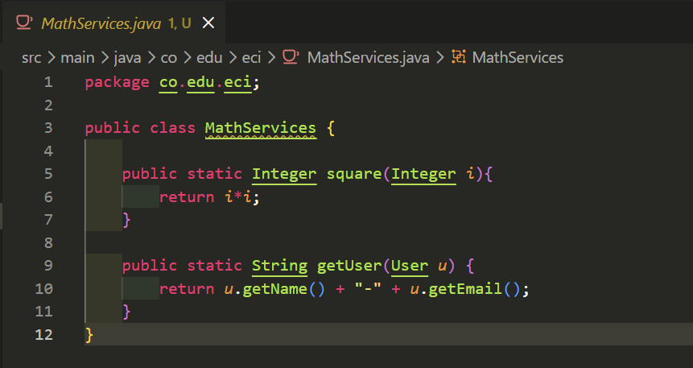 |
| Lambda creation | 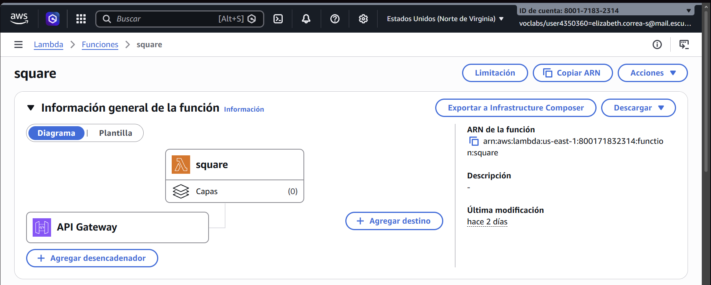 |
| Lambda handler configuration | 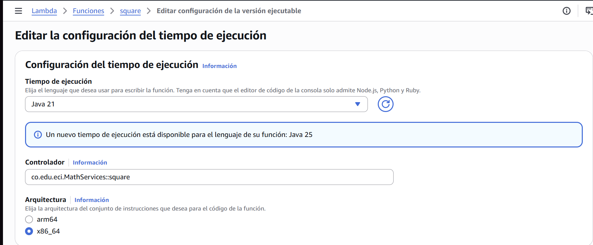 |
| Lambda test event | 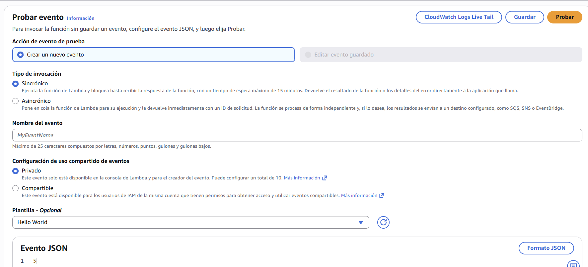 |
| Lambda test result | 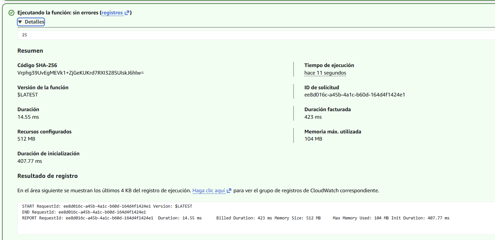 |
| API Gateway GET method | 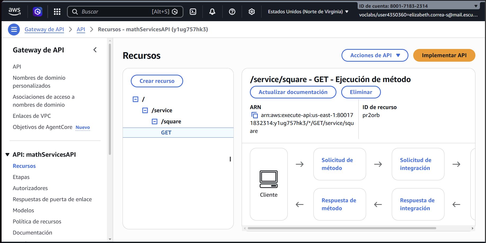 |
| API Gateway test | 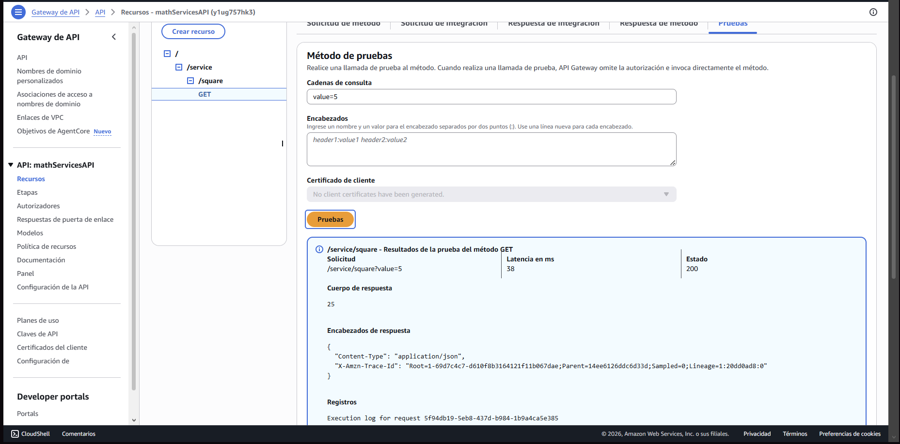 |
| Deployment stage | 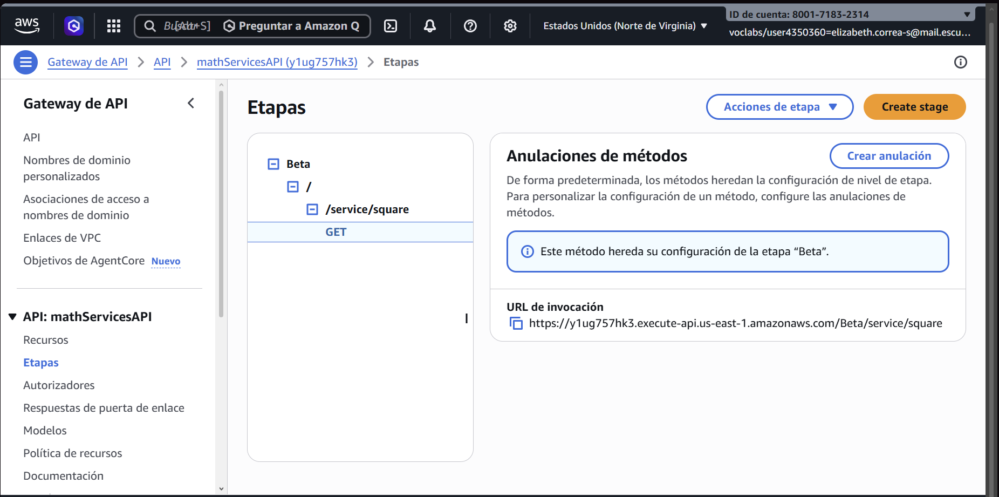 |
| Final response | 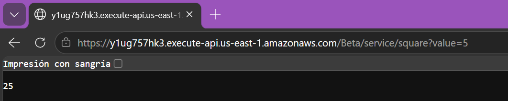 |

## 2. User Example

This second walkthrough shows the JSON-based version of the exercise. Instead of a primitive type, the Lambda method receives and returns a `User` object.

### 2.1 User Model and Handler

The repository includes a simple Java bean so AWS Lambda can serialize and deserialize JSON automatically.

```java
package co.edu.eci;

public class User {
    private String name;
    private String email;

    public User() {
    }

    public User(String name, String email) {
        this.name = name;
        this.email = email;
    }

    public String getName() {
        return name;
    }

    public void setName(String name) {
        this.name = name;
    }

    public String getEmail() {
        return email;
    }

    public void setEmail(String email) {
        this.email = email;
    }
}
```

The handler method is:

```java
package co.edu.eci;

public class MathServices {
    public static User getUser(User u) {
        return u;
    }
}
```

The AWS handler string is:

```text
co.edu.eci.MathServices::getUser
```

### 2.2 Lambda Configuration

Create another Lambda function with the same general approach as the square example:

- Choose **Author from scratch**.
- Name the function something like `user`.
- Select **Java 21** as the runtime.
- Use an existing execution role, such as `LabRole`.

Upload the JAR and set the handler to:

```text
co.edu.eci.MathServices::getUser
```

Create a test event with a JSON `User` payload.

### 2.3 API Gateway Configuration

Create a separate REST API or a separate resource/method for the user flow.

For the `GET` method, add the needed request parameters and mapping so the input is forwarded correctly to Lambda.

The deployed URL used for this example was:

```text
https://pef8t9jg50.execute-api.us-east-1.amazonaws.com/Beta/getUser?name=Elizabeth&email=elizabeth.correa-s@mail.escuelaing.edu.co
```


### 2.4 User Screenshots

| Step | Image |
| --- | --- |
| User class source code | 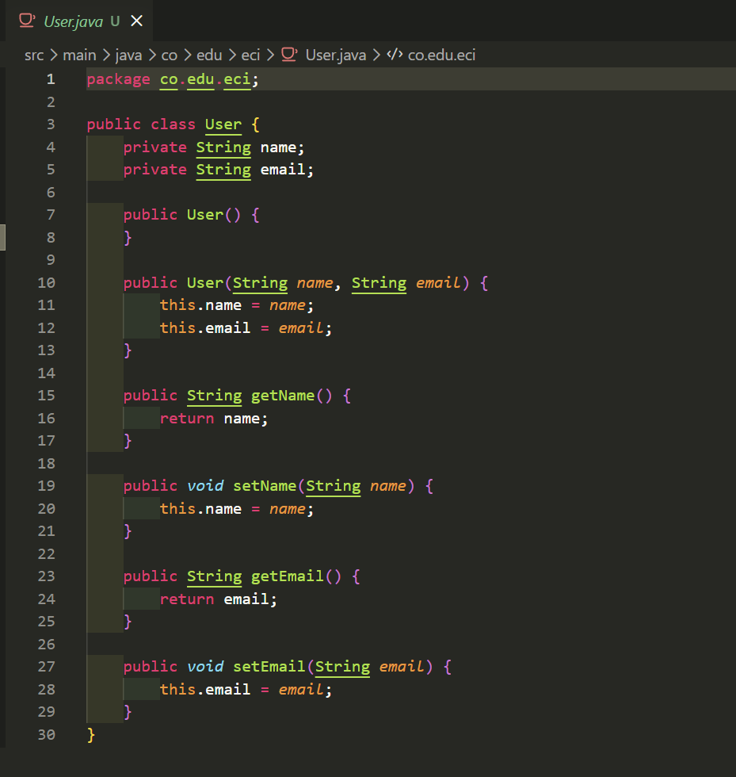 |
| Lambda user function | 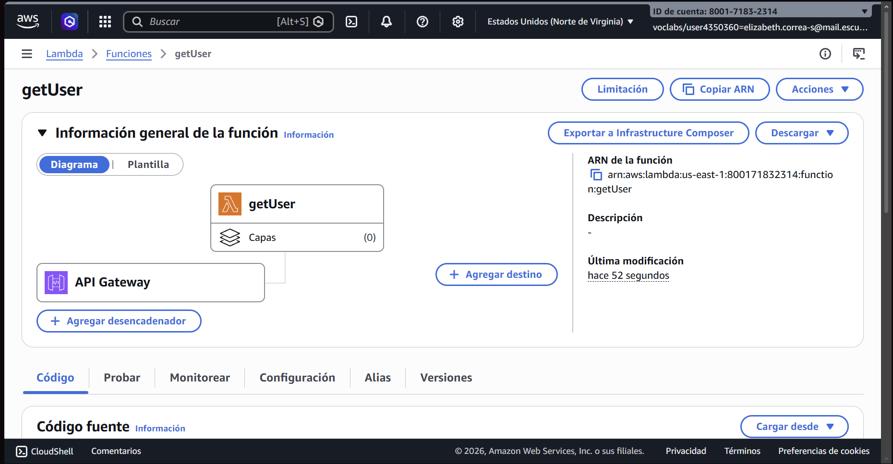 |
| User handler | 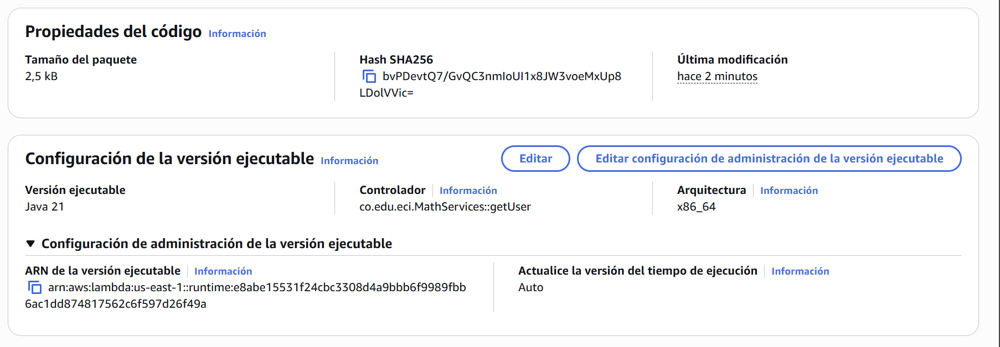 |
| User test event | 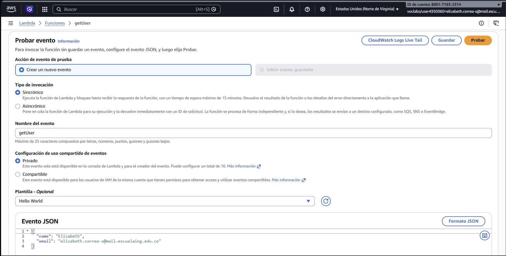 |
| User test result | 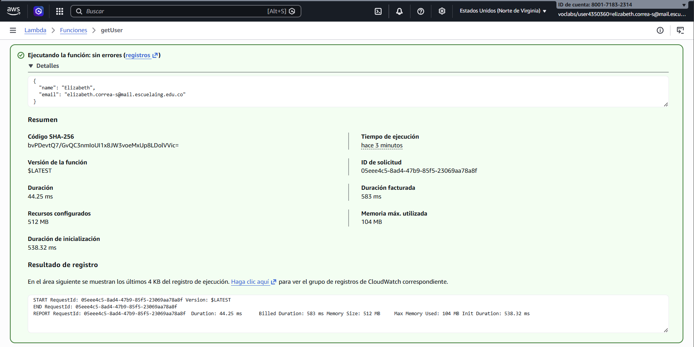 |
| User GET method | 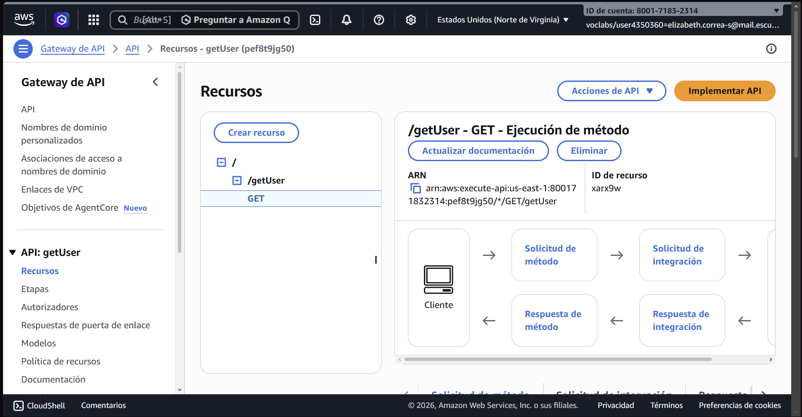 |
| User method request | 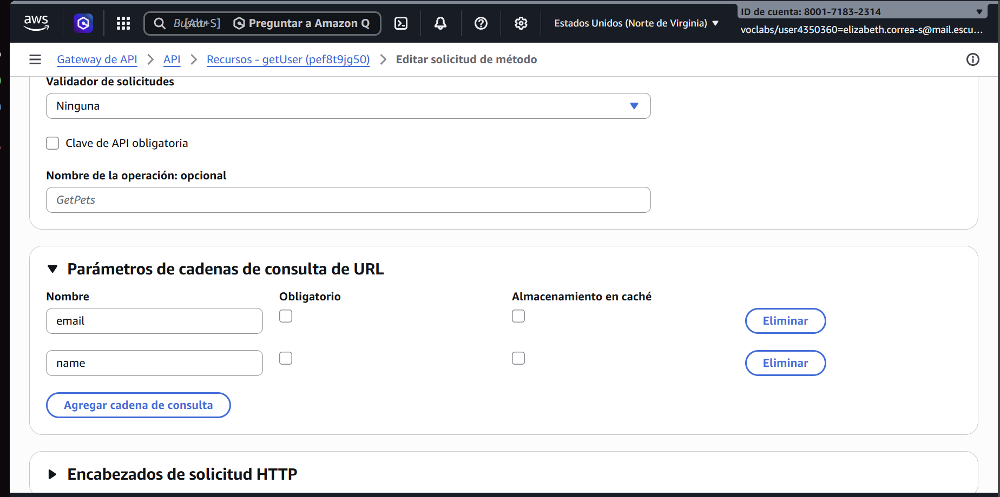 |
| User integration request | 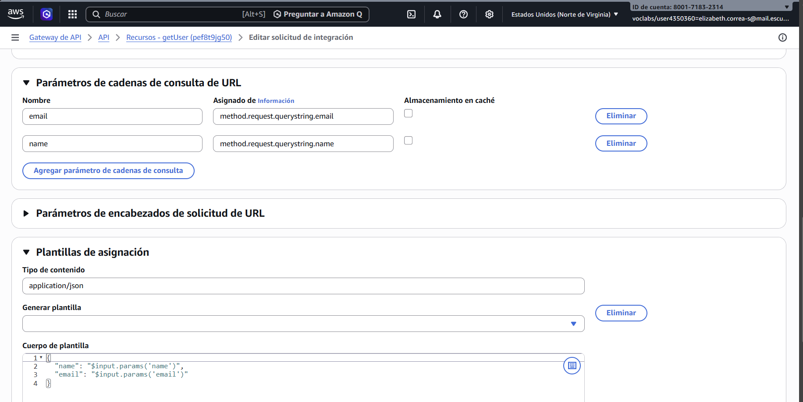 |
| User API test | 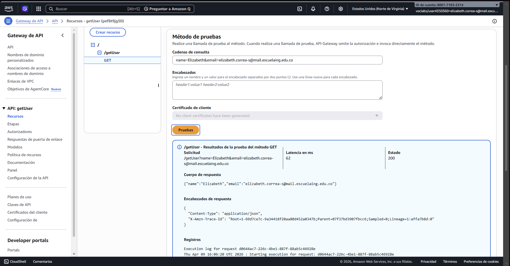 |
| Deployment stage | 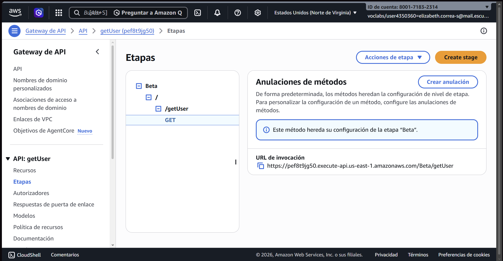 |
| Final response | 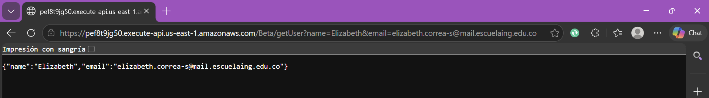 |

## Cleanup

After finishing the exercise, delete the Lambda functions and API Gateway resources to avoid unnecessary charges.

## Key Takeaways

- A Lambda handler can accept and return simple types such as `Integer`.
- API Gateway can map query string parameters directly to Lambda input.
- Lambda can also work with JSON and POJO classes when the input includes a properly structured Java bean.
- The package name and handler string must match exactly what is deployed in AWS.
